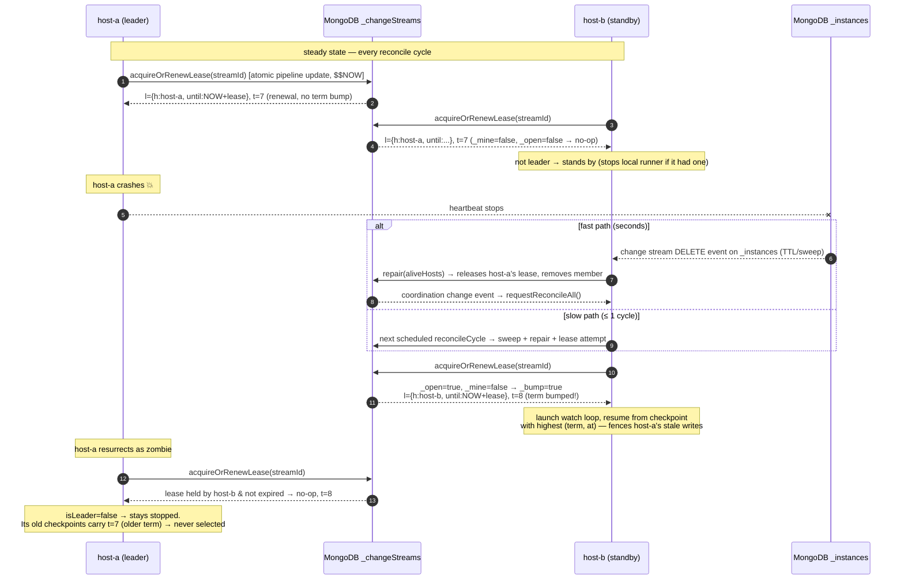
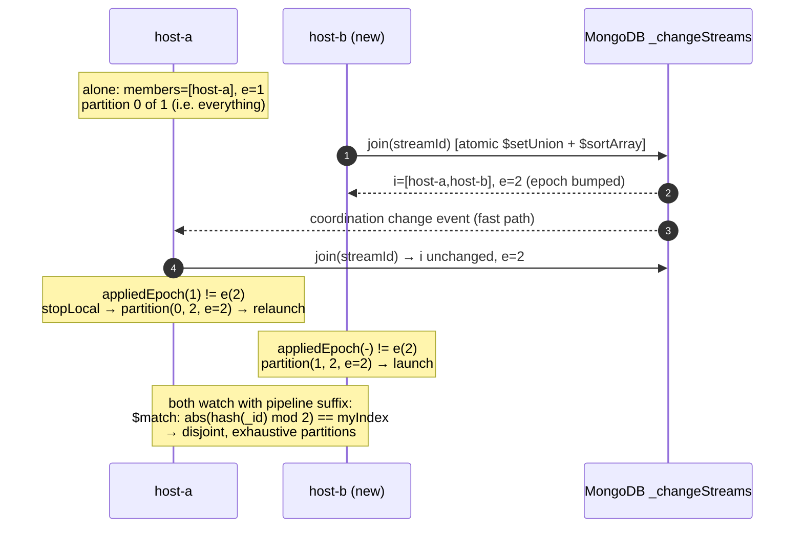

# Change Stream Coordination — Design Document

This document describes the distributed coordination mechanism that governs
which instance(s) run each MongoDB change stream, how leadership and
partitioning are decided, and how resume tokens are fenced against zombie
leaders. It also documents, in JSON, every aggregation pipeline the mechanism
uses.

Source of truth for this document:

| Concern | Class |
|---|---|
| Reconcile driver (scheduled loop) | `ChangeStreamManager` |
| Mode state machine, resume tokens, watch lifecycle | `ChangeStreamService` |
| All coordination-document mutations | `ChangeStreamCoordinator` |
| Watch loop + partition pipeline | `ChangeStream` |
| Low-latency reaction to coordination changes | `CoordinationChangeListener` |
| Instance heartbeats (companion module) | `mongodb-spring-discovery` |

---

## 1. Design Overview

The mechanism is **MongoDB-document-based leader leasing with fencing terms,
membership epochs, and heartbeat liveness**. There is no external lock
service (no ZooKeeper/etcd/Redis); MongoDB itself is the coordination
substrate.

Key principles:

1. **Single source of truth** — one coordination document per stream in the
   `_changeStreams` collection holds the entire distributed state.
2. **Atomicity** — every mutation is a single `findOneAndUpdate` /
   `updateMany` with an *aggregation-pipeline update*. Concurrent instances
   can never interleave partial writes.
3. **Server time only** — lease expiry is evaluated against `$$NOW` (MongoDB
   server time) inside the update pipeline, so the mechanism is immune to
   application clock skew.
4. **Fencing** — a monotonic term `t` is bumped *only* when the lease changes
   holder. Resume-token checkpoints are stamped with the term, so a deposed
   (zombie) leader can never move the legitimate resume position.
5. **Level-triggered core, edge-triggered optimization** — the periodic
   reconcile loop is authoritative; change-stream notifications on the
   coordination and instance collections merely reduce reaction latency.
   Lost events are always healed within one cycle.

### 1.1 The coordination document

Collection: `change-stream.coordinationCollection` (default `_changeStreams`).
One document per stream id:

```json
{
  "_id": "order-summary",
  "l":   { "h": "host-a", "until": { "$date": "2026-07-30T12:00:00Z" } },
  "t":   { "$numberLong": "7" },
  "i":   [ "host-a", "host-b" ],
  "e":   { "$numberLong": "12" },
  "at":  { "$date": "2026-07-30T11:58:30Z" }
}
```

| Field | Meaning |
|---|---|
| `l` | Leader **lease**: holder hostname `h` + server-time expiry `until`. `null` = no leader / open lease. |
| `t` | **Fencing term**. Bumped on every leadership *change of holder* (never on renewal). |
| `i` | Sorted list of member hostnames. Sorting makes partition assignment deterministic. |
| `e` | **Membership epoch**. Bumped on every membership change; drives AUTO_SCALE repartitioning. |
| `at` | Server time of the last *effective* change (no-op updates do not touch it). |

### 1.2 Supporting collections

| Collection (default) | Written by | Purpose |
|---|---|---|
| `_changeStreams` | `ChangeStreamCoordinator` | Coordination documents (above) |
| `_instances` | `mongodb-spring-discovery` heartbeat (5s upsert) + TTL index | Instance liveness |
| `_resumeTokens` | `ChangeStreamService.saveCheckpoint` | Per-host, term-stamped checkpoints; TTL on `at` |
| `_changeStreamConfigs` | `ChangeStreamConfigService` | Persisted stream definitions |

### 1.3 Operation modes

| Mode | Who runs the stream | Coordination primitives used |
|---|---|---|
| `BROADCAST` | Every member, full stream | membership only (`i`, `e`) |
| `AUTO_RECOVER` | Exactly the lease holder; automatic failover | lease `l` + fencing term `t` |
| `AUTO_SCALE` | Every member, disjoint hash partition | membership `i` + epoch `e` (partition = index in sorted `i`) |

---

## 2. Component Diagram

```
 ┌───────────────────────────────  Instance (host-a)  ───────────────────────────────┐
 │                                                                                   │
 │  @Scheduled (configRefreshInterval)                                               │
 │  ┌──────────────────────┐   reconcile   ┌─────────────────────┐                   │
 │  │  ChangeStreamManager ├──────────────▶│ ChangeStreamService │                   │
 │  │  - coordinate()      │               │ - doReconcile()     │                   │
 │  │  - housekeeping()    │               │ - launch/stopLocal  │                   │
 │  │  - refresh configs   │               │ - partition()       │                   │
 │  │  - cleanOrphans()    │               │ - checkpoints       │                   │
 │  └──────────┬───────────┘               └───────┬──────┬──────┘                   │
 │             │                                   │      │                          │
 │             │ watches _changeStreams            │      │ per-stream watch loops   │
 │             ▼                                   │      ▼                          │
 │  ┌──────────────────────────┐   join/lease/     │  ┌──────────────────┐           │
 │  │ CoordinationChange-      │   leave/repair    │  │ ChangeStream     │           │
 │  │ Listener (fast path)     │                   │  │ .watch()         │           │
 │  └──────────────────────────┘                   │  │ + scaled pipeline│           │
 │                                                 ▼  └────────┬─────────┘           │
 │                                  ┌────────────────────────┐ │                     │
 │                                  │ ChangeStreamCoordinator│ │                     │
 │                                  │ (atomic $$NOW updates) │ │                     │
 │                                  └───────────┬────────────┘ │                     │
 └──────────────────────────────────────────────┼──────────────┼─────────────────────┘
                                                │              │
                 ┌──────────────────────────────▼──────────────▼──────────────┐
                 │                          MongoDB                           │
                 │  _changeStreams   _instances   _resumeTokens   _change-    │
                 │  (coordination)   (heartbeat)  (checkpoints)   StreamConfigs│
                 │        ▲                ▲                                  │
                 └────────┼────────────────┼──────────────────────────────────┘
                          │                │ heartbeat every 5s (discovery module)
                 same protocol from every other instance (host-b, host-c, ...)
```

---

## 3. The Reconcile Cycle (authoritative, level-triggered)

Every instance runs `ChangeStreamManager.reconcileCycle()` on a fixed delay
(`change-stream.configRefreshInterval`, default 30s):

```
reconcileCycle()
 ├─ 1. coordinate()        ensure the self-watching coordination stream
 │                         ("change-stream", BROADCAST on _changeStreams) runs
 ├─ 2. housekeeping()
 │     ├─ sweepDeadInstances()   delete _instances heartbeats older than
 │     │                         instanceLivenessTimeout (faster than TTL monitor)
 │     └─ repair(alive)          updateMany over ALL coordination docs:
 │                               remove dead members, release dead/expired leases
 ├─ 3. refresh()           diff _changeStreamConfigs → start / restart / stop streams
 ├─ 4. reconcileAll()      per stream: ChangeStreamService.doReconcile()
 └─ 5. cleanOrphans(ids)   delete coordination docs with no members, no leader, no config
```

Per stream, `ChangeStreamService.doReconcile()` executes the mode state
machine:

```
doReconcile(runtime)
 ├─ coordination = coordinator.join(streamId)          // atomic member upsert
 ├─ if AUTO_RECOVER: coordination = coordinator.acquireOrRenewLease(streamId)
 ├─ apply(runtime, coordination)                        // cache term/epoch locally
 └─ switch (mode)
     ├─ BROADCAST:     if not active → launch()
     ├─ AUTO_RECOVER:  if isLeader(me)      → launch() if not active
     │                 else if active       → stopLocal()   // deposed
     └─ AUTO_SCALE:    index = members.indexOf(me), size = members.size()
                       if appliedEpoch != e → stopLocal();
                                              partition(index, size, e);
                                              launch()
```

Local concurrency inside one JVM is serialized with a per-stream
`ReentrantLock` (`ChangeStreamService.lockFor`), so the scheduled loop and the
fast path never race on the same runtime.

---

## 4. Leader Election (AUTO_RECOVER) — Sequence Diagram



Correctness properties:

- **Mutual exclusion (steady state):** the lease can only change holder when
  it is `null` or expired *by server time*, decided inside one atomic update.
- **No stale-checkpoint corruption:** resume selection for AUTO_RECOVER sorts
  by `(term DESC, at DESC)`; a zombie's checkpoints carry an older term.
- **Liveness:** a dead leader is deposed at latest after
  `min(leaseDuration, instanceLivenessTimeout + one reconcile cycle)`; the
  fast path (delete event on `_instances`) usually makes it seconds.

## 5. AUTO_SCALE Partitioning — Sequence Diagram



The partition assignment is derived purely from the *sorted* member list and
the epoch, so all instances compute identical, non-overlapping partitions and
repartition exactly once per membership change. Resume selection after a
repartition takes the *oldest* checkpoint across hosts (at-least-once over
the repartition boundary).

---

## 6. Resume Token Fencing

Checkpoints live in `_resumeTokens`, keyed per `(streamId, host)`, stamped
with the fencing term:

```json
{
  "_id": { "cs": "order-summary", "h": "host-a" },
  "t":   "<resume token _data string>",
  "term": { "$numberLong": "7" },
  "at":  { "$date": "2026-07-30T11:59:59Z" }
}
```

Resume selection on (re)start, by mode:

| Mode | Selection | Rationale |
|---|---|---|
| `AUTO_RECOVER` | highest `(term, at)` across all hosts | last *legitimate* leader wins; zombie fenced out |
| `BROADCAST` | own host's checkpoint; fallback: oldest | each member has its own position |
| `AUTO_SCALE` | oldest `at` across all hosts | at-least-once across repartitioning |

Tokens are applied with the driver's `startAfter` (survives invalidate
events). Non-resumable errors (codes 260 / 280 / 286) cause the poisoned
checkpoint to be deleted across all hosts and the stream restarted fresh.

---

## 7. Aggregation Pipelines (JSON)

All placeholders: `<hostname>` = `change-stream.hostname` of the calling
instance; `<leaseDurationMs>` = `change-stream.leaseDuration` (default
`90000`). Temporary fields (`_l`, `_m`, `_mine`, `_open`, `_acq`, `_bump`)
are computed and removed within the same atomic update.

Every coordination pipeline starts by normalizing the leader field
(`normalizedLease()`), which lazily migrates legacy string-leader documents:

```json
{
  "$cond": [
    { "$eq": [ { "$type": "$l" }, "string" ] },
    null,
    { "$ifNull": [ "$l", null ] }
  ]
}
```

(Referenced below as `<normalizedLease>`.)

### 7.1 `acquireOrRenewLease` — leader election / lock acquisition

`findOneAndUpdate({_id: streamId}, pipeline, {upsert: true, returnDocument: AFTER})`

```json
[
  { "$set": { "_l": "<normalizedLease>" } },

  { "$set": {
      "_mine": { "$eq": [ { "$ifNull": [ "$_l.h", null ] }, "<hostname>" ] },
      "_open": { "$or": [
        { "$eq": [ { "$ifNull": [ "$_l", null ] }, null ] },
        { "$lt": [ { "$ifNull": [ "$_l.until", { "$date": "1970-01-01T00:00:00Z" } ] }, "$$NOW" ] }
      ] }
  } },

  { "$set": {
      "_acq":  { "$or": [ "$_mine", "$_open" ] },
      "_bump": { "$and": [ { "$not": [ "$_mine" ] }, "$_open" ] }
  } },

  { "$set": {
      "l": { "$cond": [
        "$_acq",
        { "h": "<hostname>", "until": { "$add": [ "$$NOW", "<leaseDurationMs>" ] } },
        "$_l"
      ] },
      "t": { "$cond": [
        "$_bump",
        { "$add": [ { "$ifNull": [ "$t", 0 ] }, 1 ] },
        { "$ifNull": [ "$t", 0 ] }
      ] },
      "at": { "$cond": [ "$_bump", "$$NOW", { "$ifNull": [ "$at", "$$NOW" ] } ] }
  } },

  { "$unset": [ "_l", "_mine", "_open", "_acq", "_bump" ] }
]
```

Semantics: acquire if the lease is mine (`_mine`, renewal) **or** free /
expired by server time (`_open`, takeover). The term `t` bumps only on
takeover by a different host (`_bump`), never on renewal — this is the
fencing guarantee, and it also lets followers ignore pure renewal events.

### 7.2 `join` — atomic membership registration

`findOneAndUpdate({_id: streamId}, pipeline, {upsert: true, returnDocument: AFTER})`

```json
[
  { "$set": {
      "_m": { "$ifNull": [ "$i", [] ] },
      "_l": "<normalizedLease>"
  } },

  { "$set": {
      "i": { "$sortArray": {
        "input": { "$setUnion": [ "$_m", [ "<hostname>" ] ] },
        "sortBy": 1
      } },
      "l": "$_l",
      "t": { "$ifNull": [ "$t", 0 ] }
  } },

  { "$set": {
      "e": { "$cond": [
        { "$in": [ "<hostname>", "$_m" ] },
        { "$ifNull": [ "$e", 0 ] },
        { "$add": [ { "$ifNull": [ "$e", 0 ] }, 1 ] }
      ] },
      "at": { "$cond": [
        { "$in": [ "<hostname>", "$_m" ] },
        { "$ifNull": [ "$at", "$$NOW" ] },
        "$$NOW"
      ] }
  } },

  { "$unset": [ "_m", "_l" ] }
]
```

Semantics: `$setUnion` + `$sortArray` keep `i` sorted and duplicate-free; the
epoch `e` bumps only when this host was not already a member. If nothing
changes, the server treats the update as a no-op (no change stream event).

### 7.3 `leave` — deregistration + conditional lease release

`findOneAndUpdate({_id: streamId}, pipeline, {returnDocument: AFTER})`

```json
[
  { "$set": {
      "_m": { "$ifNull": [ "$i", [] ] },
      "_l": "<normalizedLease>"
  } },

  { "$set": {
      "i": { "$filter": {
        "input": "$_m", "as": "m",
        "cond": { "$ne": [ "$$m", "<hostname>" ] }
      } },
      "l": { "$cond": [
        { "$eq": [ { "$ifNull": [ "$_l.h", null ] }, "<hostname>" ] },
        null,
        "$_l"
      ] }
  } },

  { "$set": {
      "e": { "$cond": [
        { "$ne": [ { "$size": "$i" }, { "$size": "$_m" } ] },
        { "$add": [ { "$ifNull": [ "$e", 0 ] }, 1 ] },
        { "$ifNull": [ "$e", 0 ] }
      ] },
      "t": { "$ifNull": [ "$t", 0 ] },
      "at": { "$cond": [
        { "$or": [
          { "$ne": [ { "$size": "$i" }, { "$size": "$_m" } ] },
          { "$eq": [ { "$ifNull": [ "$_l.h", null ] }, "<hostname>" ] }
        ] },
        "$$NOW",
        { "$ifNull": [ "$at", "$$NOW" ] }
      ] }
  } },

  { "$unset": [ "_m", "_l" ] }
]
```

### 7.4 `repair` — cluster-wide healing (dead members / dead or expired leases)

`updateMany({}, pipeline)` — run by *every* instance each cycle; documents
needing no repair are server-side no-ops (no write, no event).
`<aliveHosts>` = hostnames with a fresh heartbeat in `_instances` (always
including the caller).

```json
[
  { "$set": {
      "_m": { "$ifNull": [ "$i", [] ] },
      "_l": "<normalizedLease>"
  } },

  { "$set": {
      "i": { "$filter": {
        "input": "$_m", "as": "m",
        "cond": { "$in": [ "$$m", "<aliveHosts>" ] }
      } },
      "l": { "$cond": [
        { "$or": [
          { "$eq": [ { "$ifNull": [ "$_l", null ] }, null ] },
          { "$not": [ { "$in": [ { "$ifNull": [ "$_l.h", null ] }, "<aliveHosts>" ] } ] },
          { "$lt": [ { "$ifNull": [ "$_l.until", { "$date": "1970-01-01T00:00:00Z" } ] }, "$$NOW" ] }
        ] },
        null,
        "$_l"
      ] }
  } },

  { "$set": {
      "e": { "$cond": [
        { "$ne": [ { "$size": "$i" }, { "$size": "$_m" } ] },
        { "$add": [ { "$ifNull": [ "$e", 0 ] }, 1 ] },
        { "$ifNull": [ "$e", 0 ] }
      ] },
      "t": { "$ifNull": [ "$t", 0 ] },
      "at": { "$cond": [
        { "$or": [
          { "$ne": [ { "$size": "$i" }, { "$size": "$_m" } ] },
          { "$and": [
            { "$ne": [ { "$ifNull": [ "$_l", null ] }, null ] },
            { "$eq": [ { "$ifNull": [ "$l", null ] }, null ] }
          ] }
        ] },
        "$$NOW",
        { "$ifNull": [ "$at", "$$NOW" ] }
      ] }
  } },

  { "$unset": [ "_m", "_l" ] }
]
```

### 7.5 `reset` — stop a stream on every instance

`findOneAndUpdate({_id: streamId}, pipeline, {upsert: true, returnDocument: AFTER})`
— bumps *both* term and epoch so every instance fences and re-evaluates.

```json
[
  { "$set": {
      "l": null,
      "i": [],
      "t": { "$add": [ { "$ifNull": [ "$t", 0 ] }, 1 ] },
      "e": { "$add": [ { "$ifNull": [ "$e", 0 ] }, 1 ] },
      "at": "$$NOW"
  } }
]
```

### 7.6 Watch pipeline: AUTO_SCALE partition stage

Appended by `ChangeStream.getScaledPipeline()` *after* the user's own
pipeline stages. `<size>` = member count, `<index>` = this host's position in
the sorted member list `i`:

```json
{
  "$match": {
    "$expr": {
      "$eq": [
        { "$abs": { "$mod": [ { "$toHashedIndexKey": "$documentKey._id" }, "<size>" ] } },
        "<index>"
      ]
    }
  }
}
```

`$toHashedIndexKey` gives a stable server-side hash of the document key, so
every event lands in exactly one partition regardless of which instance
evaluates it.

### 7.7 Watch pipeline: the coordination stream itself

Registered by `ChangeStreamManager.coordinate()` (stream id `change-stream`,
mode `BROADCAST`, watching `_changeStreams`):

```json
[
  { "$match": { "operationType": { "$in": [ "insert", "update", "delete" ] } } }
]
```

`CoordinationChangeListener` filters the events further in Java: update
events touching only `l.until` (pure lease renewals) are ignored to avoid
reconcile churn; everything else triggers `requestReconcile(streamId)`.

### 7.8 Watch pipeline: instance discovery stream

Registered by the discovery module (stream id `discovery`, mode `BROADCAST`,
watching `_instances`, with `fullDocumentBeforeChange: "required"`):

```json
[
  { "$match": { "operationType": { "$in": [ "insert", "update", "delete" ] } } }
]
```

DELETE events on `_instances` (a heartbeat expiring or being swept) trigger
the fast failover path: `repair(alive)` + `requestReconcileAll()`.

---

## 8. Timing & Tuning

| Property | Default | Role in coordination |
|---|---|---|
| `change-stream.configRefreshInterval` | 30 s | Reconcile cycle = lease renewal period; must be ≪ `leaseDuration` |
| `change-stream.leaseDuration` | 90 s | AUTO_RECOVER failover upper bound (keep at ~3× refresh interval) |
| `change-stream.instanceLivenessTimeout` | 50 s | Heartbeat staleness cutoff; align with `discovery.heartbeat.interval × discovery.heartbeat.max` |
| `discovery.heartbeat.interval` | 5 s | Heartbeat upsert period into `_instances` |
| `change-stream.tokenMaxLifeTime` | 24 h | TTL of resume-token checkpoints |

Failure-detection interplay: a crashed leader is deposed either when its
lease expires (`leaseDuration`) or earlier when its heartbeat is swept
(`instanceLivenessTimeout`) and `repair` releases the lease — whichever
happens first. The `_instances` delete event makes the takeover near-instant
in practice; the scheduled cycle guarantees it even if the event is lost.
